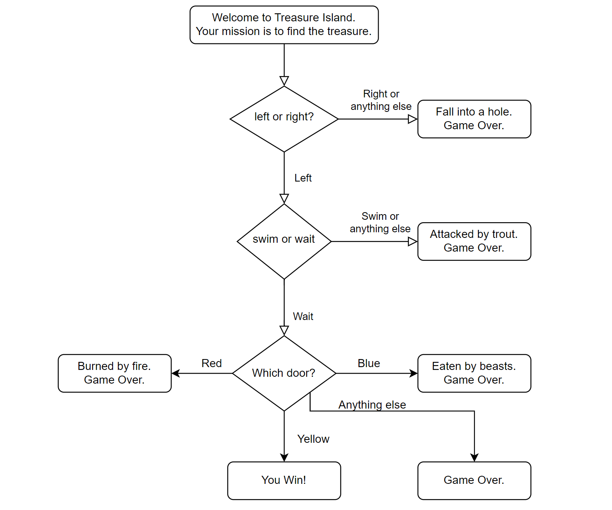

# Tresure_Island
- https://app.diagrams.net/?lightbox=1&highlight=0000ff&edit=_blank&layers=1&nav=1&title=Treasure%20Island%20Conditional.drawio#Uhttps%3A%2F%2Fdrive.google.com%2Fuc%3Fid%3D1oDe4ehjWZipYRsVfeAx2HyB7LCQ8_Fvi%26export%3Ddownload
  - 
- https://ascii.co.uk/art/treasure

Inspired from a treasure island book, It is a simple text based game to find a treasure. able to create thanks to MLH live session.

What it does

It asked for user input to left or right. After that on the user choice go to next stage of game.
From second stage user get 2 option to choose waiting for a boat or swimming toward the island.
From third stage user get 3 option to choose the door to get to trasure only one of the door is right option.Let Have a Fun!! 😁🎯. 

