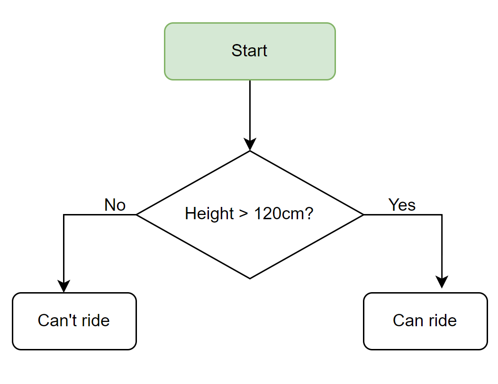
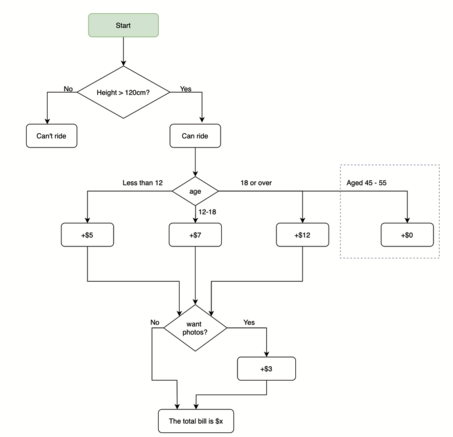
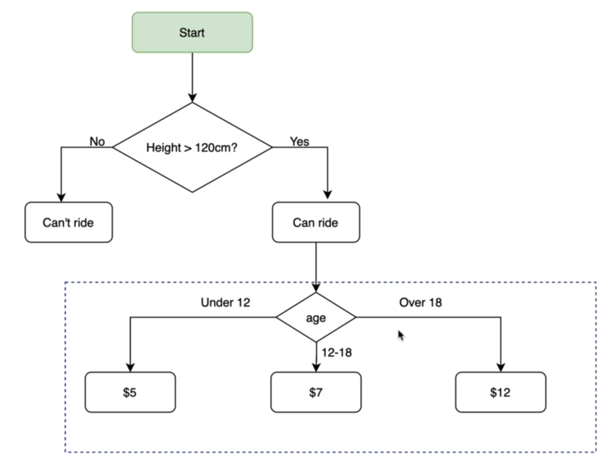

# Control Flow with if _ else and Conditional Operators
```
if condition:
    do this
else:
    do this
```

### nested if/else
```
if condition:
    if another_condition:
        do this
    else:
        do this
else:
    do this
```

### if/elif/else
```
if condition1:
    do A
elif condition2:
    do B
elif condition3:
    do C
else:
    do this
```

### multiple if
```
if condition1:
    do this
if condition2:
    do this
if condition3:
    do this
```

### multiple condition:
* Logical operators: and or not
    ```
    a = 15
    a < 20 and a > 10 => True
    a < 10 or a > 20 => False
    not a < 10 => True
    ```
```
if condition1 and condition2 and condition3:
  do this
elif condition4 or condition5:
  do this
elif not condition6:
  do this
else:
  do this
```

* Comparison operators: >   >=   <   <=   ==   !=

#### example1: rollercoaster ticket

```
print("Welcome to the rollercoaster!")
height = int(input("What is your height in cm? "))
if height >= 120:
    print("You can ride the rollercoaster!")
else:
    print("Sorry, you have to grow taller before you can ride;.")
```

#### example2: roller coaster ticket and picture

```
print("Welcome to the rollercoaster!")
height = int(input("What is your height in cm? "))

cost = 0
if height >= 120:
    print("You can ride the rollercoaster!")
    age = int(input("How old are you? "))

    if age < 12:
        cost = 5

    elif age <= 18:
        cost = 7
    # age 45 - 55
    elif age >= 45 and age <= 55:
        cost = 0
    else:
        cost = 12

    photo = input("Do you want a photo or not?(yes,no) ")

    if photo == "yes":
        cost += 3

    print(f"Pleasy pay ${cost}.")
else:
    print("Sorry, you have to grow taller before you can ride;.")
```

#### example3: roller coaster ticket

```
print("Welcome to the rollercoaster!")
height = int(input("What is your height in cm? "))
age = int(input("How old are you? "))
if height >= 120:
    print("You can ride the rollercoaster!")
    if age < 12:
        print("Please pay $5.")
    elif age <= 18:
        print("Please pay $7.")
    else:
        print("Please pay $12.")
else:
    print("Sorry, you have to grow taller before you can ride;.")
```
