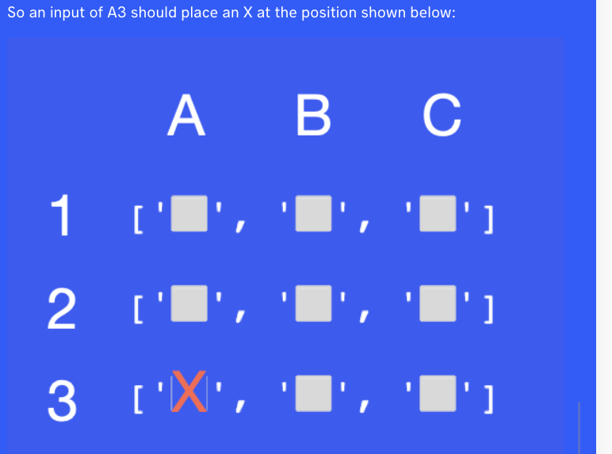

# Instructions

You are going to write a program that will mark a spot with an X.

In the starting code, you will find a variable called map.
This map contains a nested list. When map is printed this is what the nested list looks like:
[['⬜️', '⬜️', '⬜️'],['⬜️', '⬜️', '⬜️'],['⬜️', '⬜️', '⬜️']]

This is a bit hard to work with. So we've used this line of code print(f"{row1}\n{row2}\n{row3}" 
to format the 3 lists to be printed as a 3 by 3 square, each on a new line. Now it looks a bit more like the coordinates of a real map:

['⬜️', '⬜️', '⬜️']

['⬜️', '⬜️', '⬜️']

['⬜️', '⬜️', '⬜️']

    Your job is to write a program that allows you to mark a square on the map using a letter-number system.
    
    The letter in the input will specify the column (the position on the horizontal axis).
    The digit in the input will specify the row number (the position on the vertical axis). 

    First, your program must take the user input and convert it to a usable format.
    Next, you need to use that input to update your nested list with an "❌". Remember that your nested list map actually looks like this: 
    [['⬜️', '⬜️', '⬜️'],['⬜️', '⬜️', '⬜️'],['⬜️', '⬜️', '⬜️']].

### Example Input 1
    B3
## Example Output 1
    ['⬜️', '⬜️', '⬜️']
    ['⬜️', '⬜️', '⬜️']
    ['⬜️', '❌', '⬜️']

### Example Input 2
    C1
### Example Output 2
    ['⬜️', '⬜️', '❌']
    ['⬜️', '⬜️', '⬜️']
    ['⬜️', '⬜️', '⬜️']

### Hint

* for getting emoji: https://getemoji.com/
* Remember that Lists start at index 0!
* See if this List method helps you: https://www.w3schools.com/python/ref_list_index.asp
* map is just a variable that contains a nested list. It's not related to the map function in Python.
* Remember that nested lists are accessed from out to in. So if list=[[A,B,C],[E,F,G]] then E = list[1][0]
  

---

    Check that you haven't accidentally added extra spaces and the ❌ is a ❌ with a single quote around it.
    
    Correctly formatted:
    ['⬜️', '⬜️', '⬜️']
    ['⬜️', '⬜️', '⬜️']
    ['⬜️', '❌', '⬜️']

    vs.

    Incorrectly formatted (missing a space before '❌ and extra space after the ❌ and extra space before the comma):

    ['⬜️', '⬜️', '⬜️']
    ['⬜️', '⬜️', '⬜️']
    ['⬜️','❌ ' , '⬜️']
