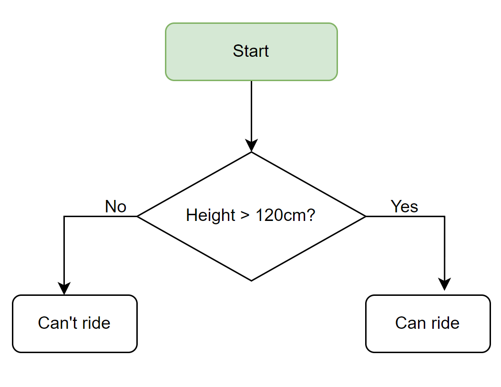
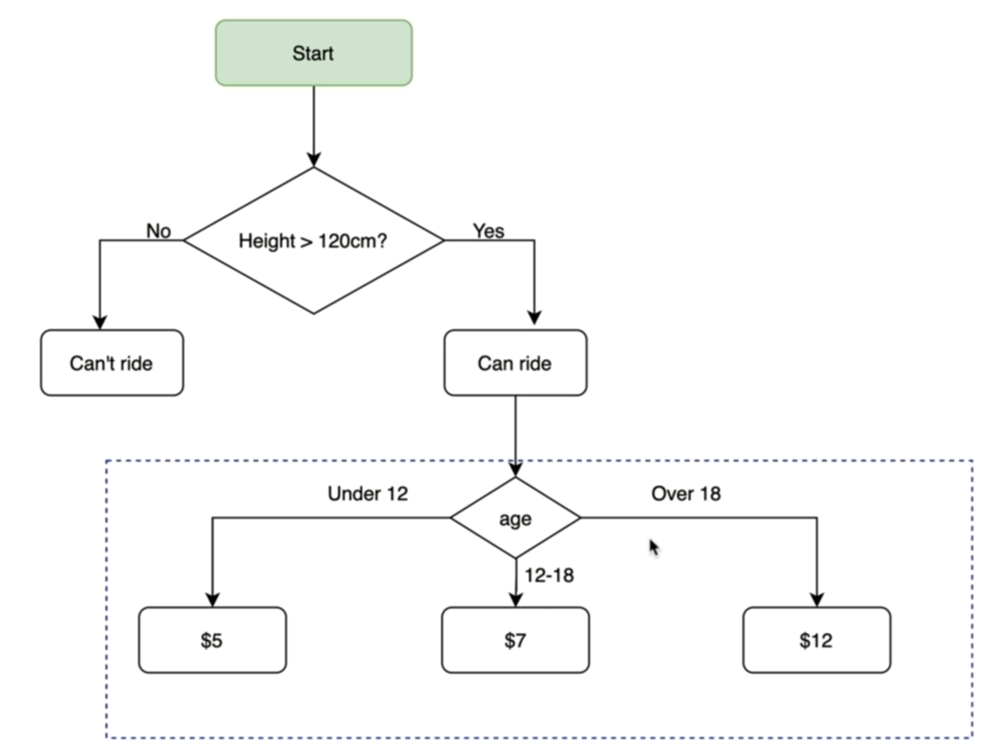

# 100 Days of python

# day 01
### for counting string 
`len("str")`
### slice string
`
"string"[start:end:step]
`

```py
print("Hello"[::-1])
```
output: olleH

## integer and float and boolean
```py
print(123_456_7890045644)
```
out: 1234567890045644

```py
print(3.141_59)
```
3.14159

```py
print(True, False)
```
True False

## convert types - type conversion (type casting)
```py
a = 123
print(type(a))                #int
print(type(float(a)))         #float
print(type(str(a)))           #str
print(70 + float("100.5"))    #170.5
print("70" + str(100))        #70100
```
## len()
* is used for counting number of characters (just string type)
* output of len function is **integer**
```py
print(len(str(123_456_7)))      # 7
```
ex:
```py
num_char = len(input("What is your name? "))
print(type(num_char))       # <class 'int'>
num_char = str(num_char)
print(type(num_char))       # <class 'str'>
print("your name has " + num_char + " characters.")
```
---
# day 02
## mathematical operations: + - / * % ** //


priority: PEMDAS
1.     Parentheses     ()
2.     Exponents       **
3.     Multiplication *  Division /    => left to right
4.     Addition +   Subtraction-       => left to right


`+= /= *=  -=`
```py
num1 += num2      # num1 = num1 + num2
num1 /= num2      # num1 = num1 / num2
num1 //= num2      # num1 = num1 // num2
num1 *= num2      # num1 = num1 * num2
num1 -= num2      # num1 = num1 - num2
```
ex:
```py
print(3 * 3 + 3 / 3 - 3)         # => (((3*3) + (3/3)) - 3) = 7.0
print(3 * (3 + 3) / 3 - 3)       # => (((3 * (3 + 3)) / 3) - 3) = 3.0

num = 8 // 4
num += 8        #=> num = num + 8
print(num)      #=> 10
num //= 2       #=> num = num // 2
print(num)      #=> 5
```

### Number Manipulation and F Strings in Python
int()
- remove numbers after point
```py
print(int(2.49))        # 2       
print(int(2.6666666))   # 2
```
  
round()
- round the number to closest one
```py
round(2.49)             # 2
round(2.6666666)        # 3
round(2.6666666, 2)     # 2.67
```

note: round() doesnt show last zero. 
- ex: round(10.6000, 2) => 10.6
- but we want float output with 2 decimal points like 10.60 so we cen do this in two ways:
  -  "{:.2f}".format(10.600000)
  -  f"{10.600000:.2f}"

/ => result is float

// => result is integer (ignore all numbers after decimal point.)

ex:
```py
print(8/3)              # => 2.6666666666666665
print(4 / 2)            # => 2.0
print(int(8/3))         # => 2
print(round(8/3))       # => 3
print(round(8 / 3, 2))  # => 2.67
print(8 // 3)           # => 2
```

### fstring
f"{var1} string {var2} string string {varn}"

ex:
```py
score = 5
age = 18
isWinning = True
print(f"you are {age} years old, and your score is {score}\
you are winning is {isWinning}")
# output: you are 18 years old, and your score is 5you are winning is True
```


---
# day 03
## Control Flow with if _ else and Conditional Operators
```python
if condition:
    do this
else:
    do this
```

### nested if/else
```python
if condition:
    if another_condition:
        do this
    else:
        do this
else:
    do this
```

### if/elif/else
```python
if condition1:
    do A
elif condition2:
    do B
elif condition3:
    do C
else:
    do this
```

### multiple if
```python
if condition1:
    do this
if condition2:
    do this
if condition3:
    do this
```

### multiple condition:
* Logical operators: and or not
    ```
    a = 15
    a < 20 and a > 10 => True
    a < 10 or a > 20 => False
    not a < 10 => True
    ```
```python
if condition1 and condition2 and condition3:
  do this
elif condition4 or condition5:
  do this
elif not condition6:
  do this
else:
  do this
```

* Comparison operators: >   >=   <   <=   ==   !=

#### example1: rollercoaster ticket

```python
print("Welcome to the rollercoaster!")
height = int(input("What is your height in cm? "))
if height >= 120:
    print("You can ride the rollercoaster!")
else:
    print("Sorry, you have to grow taller before you can ride;.")
```

#### example2: roller coaster ticket

```python
print("Welcome to the rollercoaster!")
height = int(input("What is your height in cm? "))
age = int(input("How old are you? "))
if height >= 120:
    print("You can ride the rollercoaster!")
    if age < 12:
        print("Please pay $5.")
    elif age <= 18:
        print("Please pay $7.")
    else:
        print("Please pay $12.")
else:
    print("Sorry, you have to grow taller before you can ride;.")
```
#### example3: roller coaster ticket and picture

```python
print("Welcome to the rollercoaster!")
height = int(input("What is your height in cm? "))

cost = 0
if height >= 120:
    print("You can ride the rollercoaster!")
    age = int(input("How old are you? "))

    if age < 12:
        cost = 5

    elif age <= 18:
        cost = 7
    # age 45 - 55
    elif age >= 45 and age <= 55:
        cost = 0
    else:
        cost = 12

    photo = input("Do you want a photo or not?(yes,no) ")

    if photo == "yes":
        cost += 3

    print(f"Pleasy pay ${cost}.")
else:
    print("Sorry, you have to grow taller before you can ride;.")
```
note: if num % 2 == 0,  num is even, else num is odd

---
# Day 04
## Randomisation
https://www.askpython.com/python-modules/python-random-module-generate-random-numbers-sequences

#### generate random number
```python
import random

# generate random integer number between two numbers
print(random.randint(1, 10))

# generate random floating point number between 0 and 1.  
print(random.random())

# generate random floating point number between a and b. random.uniform(a, b):    a <= random_float <= b
print(random.uniform(0, 10))
```

## Lists
https://docs.python.org/3/tutorial/datastructures.html

use list to store many pieces of related data but they also have an order base the location of items in the list.
elements in list could be any type even mixture of types.

```python
list_of_items = ["item1", "item2", "item3", "item4", "item5", "item6", "item7", "item8", "item9", "item10", "item11", "item12", "item13", "item14", "item15", "item16", "item17", "item18", "item19", "item20"]
print(list_of_items)
print(list_of_items[0])                         # => item1
print(list_of_items[-2])                        # => item19
print(list_of_items[::-1])                      # => reverse the list (just show not change)
print(list_of_items[-1])                        # => item20 (last item)
print(len(list_of_items))                       # => number of items in list
print(list_of_items[len(list_of_items) - 1])    # => item20 (last item)
list_of_items[0] = "new_item1"                  # change the first value in list
print(list_of_items)
list_of_items.append("new_item21")              # add new_item21 at the end of list (just one value)  
print(list_of_items)
list_of_items.extend(["new_item22", "new_item23", "new_item24"]) # add a list items (a bunch of values) at the end of the list
print(list_of_items)
print(random.choice(list_of_items))             # randomly select an item in list   random.choice(list)

### Nested lists: List in List
old_list = ["item1", "item2", "item3"]
new_list = ["new_item1", "new_item2", "new_item3", "new_item4"]
mixed_list = [new_list, old_list]
print(mixed_list)                               # output: [['new_item1', 'new_item2', 'new_item3', 'new_item4'], ['item1', 'item2', 'item3']]
print(mixed_list[0])                            # output: [['new_item1', 'new_item2', 'new_item3', 'new_item4']]
print(mixed_list[0][1])                         # output: new_item2
```
---
# Day 05 - Python For Loops 
```python
# for loop
items = ["item1", "item2", "item3"]
for item in items:
    print(item)

for num in range(a, b, c):
    print(num)  # a, a+c, a+c+c, ...  => [a, b) note: default c is 1
```
# Day 06 - Python Functions & Karel
```python
### define func 
def myfunc():
    # do this
    # then do this
    # finally do this

### call(execute) func
myfunc()
```
---

# extra notes

* str.replace(" ", "") => means remove all spaces in str
* "str1,str2,str3".split(sep=",") => seperate eacb item base on "," and create a list of items => ["str1", "str2", "str3"]
* len(list) => give us number of items in list. 
* len("string") => give us number of characters of "string"
* random.choice(list) = > choose one of list items randomly
* ['a', 'b', 'c'].index('b')    => 1